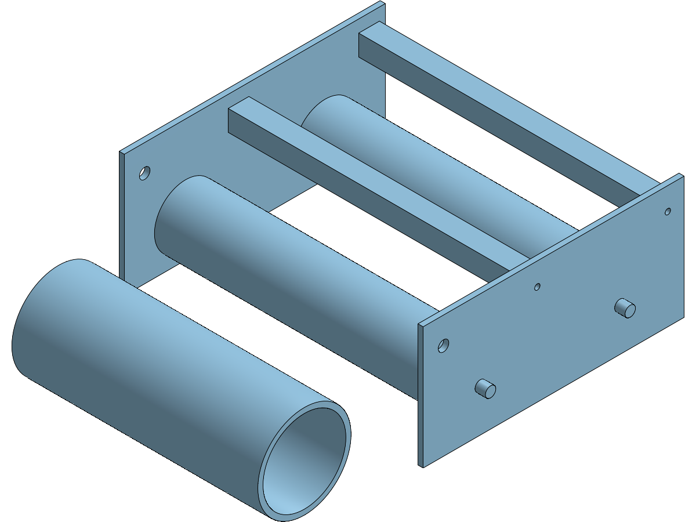

# onshape-ai

## Current Design: Choose A Concept

**[All robot concept previews](outputs/whole-robots/mechanisms/index.html)** |
[Task-specific robot interactions](outputs/whole-robots/mechanisms/viewer.html) |
[All supported task views](outputs/whole-robots/mechanisms/interactions/index.html) |
[Same L4 target, different configurations](outputs/whole-robots/mechanisms/interactions/l4-comparison.png)

Current intake focus: shortlist 01/07/09/14 is undergoing the authorized local
geometry gate. **No final two are geometry-ready yet.** The measured failures,
swerve side-mount correction and next topology decisions are in
[the intake gate report](trials/intake-finalists/README.md). Onshape continuation
still waits for a passing pair and the user's selection.

The latest revision replaces fixed-distance nearby scenes with per-task targets,
constrained mechanism configurations and measured bumper stand-off. Select L1-L4,
processor/net or acquisition tasks only where declared by that concept, then
compare approach, engagement and release. The same-task table shows each robot's
joint settings and stand-off. Declared but unreachable/overextended configurations
are explicitly flagged; alignment under assumptions is not a full-motion or physical pass.
See [the interaction study limits](outputs/whole-robots/mechanisms/interactions/README.md).

**[Revised mechanism-shaped concepts](outputs/whole-robots/mechanisms/index.html)** |
[Mechanism review](outputs/whole-robots/mechanisms/README.md) |
[Architecture standard](docs/ROBOT-ARCHITECTURE-STANDARD.md)

New: [six-state robot sheets with field context](outputs/whole-robots/mechanisms/states/index.html)
and [fourteen 3D intake state comparisons](outputs/concepts/mechanisms/index.html).
Robot scenes include collapsed/open, station, reef and cage approaches. Intakes
show open/collapsed/handoff beside their unchanged 2D flow drawings.

The user's correction sets a higher target: winning-alliance architectures with
minimal unnecessary complexity, and recognizable 3D cartoon mechanisms, not
subsystem cuboids. Revision 2 shows rollers, rails, plates, wrists, shooters and
climb hooks with one selectable configuration at a time. R03 leads the revised
shortlist; R01 is the floor-recovery/processor benchmark, R09 an algae-specialist
alternative, and R04 a conditional no-handoff challenger. R07/R08 remain contrasts,
not default powerhouse recommendations. None has demonstrated elite performance.

The durable method starts with alliance role and complete cycles/autonomous,
then acquisition/exhaust sides, field/game-piece poses, intrusive endgame space,
linear/rotary mechanisms and targeted prototyping before detail. Reference post
text and images were inspected; see the standard for precise attribution.

### Earlier Space-Claim Study

**[Ten full-robot coral + algae concepts](outputs/whole-robots/index.html)** |
[Whole-robot overview](outputs/whole-robots/overview.png) |
[Recommendations and capability matrix](outputs/whole-robots/README.md) |
[2025 game analysis](trials/whole-robot-concepts/GAME-ANALYSIS.md)

The latest user request expands Stage 2 to complete robot architectures: drive,
coral and algae acquisition/scoring, endgame, stow and electrical/service packaging.
Each sheet uses one 3D block/link dataset for axonometric, side and top views.
The original R01/R04/R07 shortlist is superseded by the Revision 2 review above.
These are untested architecture studies,
not performance rankings, solved mechanisms or native Onshape robot models.
No authenticated API calls or CAD-kernel runs were used. Choose one or two before
the [geometry/PoC stage](docs/DESIGN-WORKFLOW.md).

## Earlier Intake Concepts

**[Fourteen coral-intake concept previews](outputs/concepts/index.html)** |
[Overview PNG](outputs/concepts/overview.png) |
[Options and tradeoffs](outputs/concepts/README.md)

The intake study also remains at **Stage 2: crayola CAD**, before detailed geometry.
Choose one or two options for focused contact/motion PoCs. These approximate
side/top sketches are not proven working mechanisms. No Onshape calls or CAD
kernel runs were used for them. See the [five-stage workflow](docs/DESIGN-WORKFLOW.md).

Added 11: 1690/2056 reference hybrid, 12: actual bumper-cutout comparison (not
2025-compliant), 13: internal-bore lift and handoff, and 14: 1778 capture/raise/center
with a carrier-locked lower axle. Earlier drawings remain unchanged.

## Earlier Workflow Experiments

An executed comparison of AI CAD workflows for FRC, using a simplified 2025 coral
ground-intake packaging module. **Four routes created and revised real Onshape
CAD. Native-template reuse and real manufacturing-package follow-ups also passed.**
Local solid preflight passed; its browser stage remains blocked by the trial's
terms-of-use gate. See [current status](docs/STATUS.md).

## Recommendation

Use **native templates for repeatedly edited parts, FeatureScript for procedural
geometry, and milestone STEP snapshots for local PDF/DXF generation**. Use REST
for integration and MCP as the agent-facing tool layer. The native-template trial
preserved downstream edits in a six-call revision; manufacturing snapshots took
eight calls each, with zero-call local rerenders. No workflow here demonstrates
autonomous full-robot design or proves non-coder UI usability.

Read [the comparison and research](docs/COMPARISON.md) for evidence, tradeoffs,
request counts, failure history, and the next robot-scale test.

The user also requires research from prior robots, technical binders, forum threads,
images and season-specific rules to drive engineering decisions. A bounded 2025
study and the current concepts apply this requirement, but it is not an automated,
validated full-robot design capability. See
[the evidence-based design requirements](docs/RESEARCH-REQUIREMENTS.md).

[The team profile](docs/TEAM-PROFILE.md) records shop capabilities, metric-first
interfaces, preferred motors/vendors, FRCDesignApp access, named 2025 references
and the standalone intake/coral-handoff scope for the next design study.
[The 2025 reference index](research/2025-coral/README.md) links first-hand team
reports, CAD/binder releases, observed research gaps and two candidate architectures.
[The provisional concept decision](research/2025-coral/CONCEPT-DECISION.md) now combines
the bounded 2025 rule audit, inspected 2056 binder pages, COTS candidates, a functional
layout and tested local sizing. It is a research result, not a new completed CAD subsystem.
[The NASA RAP Robotics Design Guide digest](research/nasa-rap-design-guide/README.md)
filters that 2020 general guide for 1577: timeless rules kept, deprecated motors,
controllers, pneumatics and non-swerve drives flagged, shop-incompatible methods translated.

## Open The Outputs

All linked documents are public, as explicitly authorized after the account
rejected private creation. They contain synthetic benchmark geometry only.
Workspace links show the revision; both stages are preserved in local exports.

| Workflow | Real Onshape Model | Revision Image | Revision CAD | Trial Report |
| --- | --- | --- | --- | --- |
| Native REST: 9 sketches + 9 extrudes | [Open](https://cad.onshape.com/documents/8ed4380f4a245838e95aa4a5/w/fb131c088194dac823c29de4/e/4e3c0ad9b4c4e0b31dcc3875) | [PNG](outputs/native-api/revision-isometric.png) | [ZIP of 9 STEP parts](outputs/native-api/revision-server-export.zip) | [Evidence](trials/native-api/REPORT.md) |
| FeatureScript via REST | [Open](https://cad.onshape.com/documents/086039b6f3621e6c0c73690a/w/57576582af3edd8e81d291cf/e/c1c82d07d6491f6fe419f3fe) | [PNG](outputs/featurescript/revision.png) | [STEP](outputs/featurescript/revision.step) | [Evidence](trials/featurescript/REPORT.md) |
| Community Jarvis MCP + FeatureScript | [Open](https://cad.onshape.com/documents/c91dab628a4c5b87c23aa534/w/0c40bbe9087fa21610dff575/e/b5a7239c126b14bd4385f232) | [PNG](outputs/mcp-jarvis/revision-render-0.png) | [STEP](outputs/mcp-jarvis/revision-export-original.step) | [Evidence](trials/mcp/second-server/REPORT.md) |
| Official MCP modeling + REST verification/export | [Open](https://cad.onshape.com/documents/f92dc90f7c052de045dd2c4f/w/b60d9355149429c9c55f69c8/e/d0a579bf1b84bc1e68e06e90) | [PNG](outputs/official-mcp/revision.png) | [ZIP of 9 STEP parts](outputs/official-mcp/revision-step-original.zip) | [Evidence](trials/official-mcp/REPORT.md) |



The common task has nine solids, five through-holes per side plate, bored roller
sleeves, shafts, crossmembers and a staged coral reference. All four completed
routes measured **340 mm width / 100 mm gap**, then **360 mm / 95 mm**, preserving
their feature identities. The official route revised source defaults, not exposed
UI parameters, and used separate REST readback/export. No browser modeling or
Playwright was used. These are multi-part Part Studios, not mated Assemblies.

## Added Trial Outputs

| Trial | Actual Result | Output |
| --- | --- | --- |
| Native template + independent copy | Six-call revision preserved 8 mm thickness, moved pivot and editor-added sixth hole; original template unchanged | [Revised Onshape copy](https://cad.onshape.com/documents/2db9a7eda58817bb0ba921b8/w/511535852de274d393a2ea6c/e/87e35d1bfe08c90c7ac97c4f) · [Report](trials/native-template/REPORT.md) |
| Manufacturing package | PDF/DXF/PNG from real immutable Onshape exports; original STEP bytes retained | B: [PDF](outputs/manufacturing-package/B/package/drawing.pdf) · [PNG](outputs/manufacturing-package/B/package/drawing.png) · [DXF](outputs/manufacturing-package/B/package/profile.dxf) · [STEP](outputs/manufacturing-package/B/package/plate.step) · [Report](trials/manufacturing-package/LIVE-REPORT.md) |
| Local preflight + browser checkpoint | Six candidates and 25 sweep states passed real OpenCascade/STEP checks; browser stage BLOCKED | [Local six-hole STEP](outputs/local-preflight/candidates/B-final-six/local.step) · [Preview](outputs/local-preflight/candidates/B-final-six/local-preview.svg) · [Report](trials/local-preflight-browser/REPORT.md) |

Baseline A manufacturing files are retained beside B. All drawings remain
**EXPERIMENT - NOT FOR MANUFACTURE**: material/tolerance inputs are test assumptions,
not approved design requirements. These are local derived PDFs/DXFs, not associative
Onshape Drawing tabs.

## Reproduce And Verify

Node 24 is used. The portable checks below need no credentials or dependencies:

```powershell
node --test benchmark/*.test.mjs
```

[outputs/manifest.json](outputs/manifest.json) records original paths, sizes and
SHA-256 hashes for the 27 curated files. Baseline exports live beside revision
exports. Integrity/STEP-record checks are not an independent CAD-kernel reimport.

[outputs/followup-manifest.json](outputs/followup-manifest.json) records 30 additional
byte-preserved artifacts, including the official route, native-template evidence,
real manufacturing packages and explicitly local-only preflight outputs.

Each trial report documents its own dependencies and commands. Full historical
tests also use ignored local run fixtures and downloaded servers, so they require
this trial workspace, not just a fresh checkout. Live commands can create documents
or revise owned trial documents: do not run them merely to view the results.

The original 128-test result is historical. Follow-up checks passed 154 Node tests
outside the official route, 80 official-route tests and two new portable output
tests. Manufacturing passed 60 Python tests; local preflight recorded eight kernel
tests plus all 31 solid/STEP states. Tests and visual checks do not establish
mechanical performance or engineering approval; details are in each trial report.

## Official MCP Setup

Subscription and OAuth were completed and the live trial succeeded. These steps
are retained for another machine, not an outstanding task for this run:

1. Subscribe to [Onshape Labs FeatureScript MCP](https://cad.onshape.com/appstore/apps/Onshape%20Labs/6a29aea7c03f8bf659841734).
2. Run **MCP: List Servers** in VS Code, select `onshape-official-featurescript`
	from [.vscode/mcp.json](.vscode/mcp.json), and start it.
3. Complete client-managed OAuth in your browser and enable the discovered tools.
	Never paste keys, passwords or tokens into chat.

The official service provisions its own Workspace and Notes documents; its listing
also describes workspace deletion capability. This run verified its public managed
sandbox and retained one branch with `clean:false`. No workspace was deleted.
Its successful source-default workflow has no exposed parameter controls; the
original parameterized attempt did not compile within the tested repair sequence.
See [the official trial results](trials/official-mcp/README.md).

## Scope And Security

Independent GPT-6 Astra subagents handled each option. The requested extra-high
reasoning setting is not configurable through the agent tool; the user accepted
that limitation. Shared requirements reduce task differences, but this is not a
blinded or statistically controlled benchmark. Follow-up agents resumed their own
saved work without seeing sibling implementations; the parent compared afterward.

This is a CAD workflow PoC, **not a working intake or manufacturing release**.
Motor, transmission, bearings, fasteners, contact/motion, assemblies and rule
compliance remain excluded. Drawings were added as a bounded follow-up, not a
manufacturing release. The nominal coral reference is not a certified
game-piece drawing. STEP files include that reference solid, even when excluded
from an Onshape BOM. See [the benchmark](benchmark/intake.json).

Credentials remain in ignored local configuration; raw run data stays local.
The curated output bundle is intentional synthetic public CAD. No existing robot
documents were modified and nothing was committed. Revoke the temporary API key
when finished; [access notes](docs/ACCESS.md) explain the boundaries.

**Security action:** credentials were also entered in the shareable environment
template. It has been restored to blanks, and 199 candidate repository files were
scanned with zero remaining matches. The editor patch response echoed the old
values during cleanup: treat the temporary key as exposed and revoke it now.
Do not reuse it. Official MCP authentication uses client-managed OAuth instead.

The user subsequently explicitly authorized the current local key for these
bounded follow-ups. That authorization was recorded separately from rotation;
replacement was not asserted. Rotation remains recommended. The final observed
account usage was **479/2,500, with 2,021 remaining**; this snapshot is not a live
quota display. No further account requests are needed to inspect the outputs.
