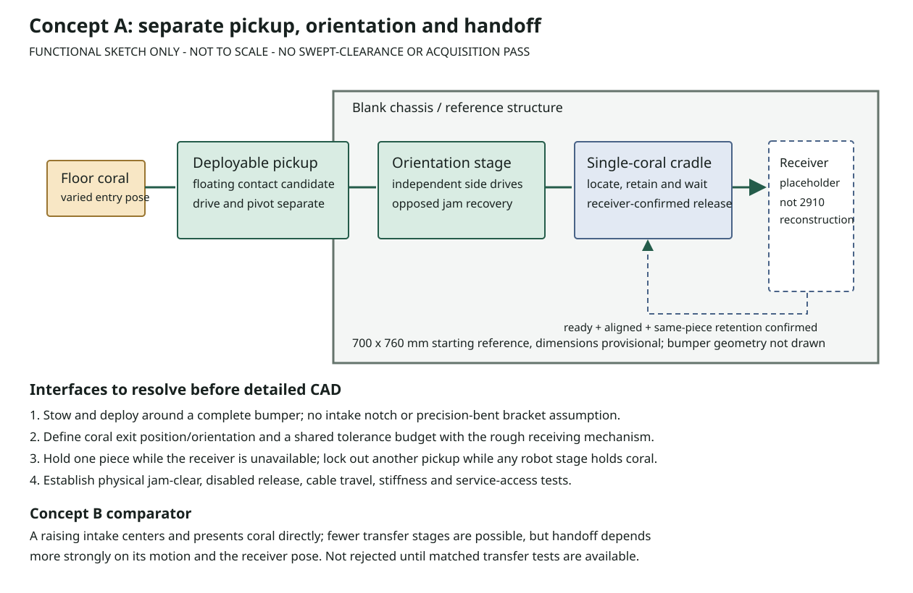
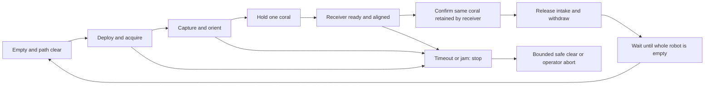

# Coral Intake: Provisional Concept Decision

Date: 2026-09-12. **Concept A is the lead candidate for the next CAD/physical study,
not a released design or demonstrated acquisition mechanism.** No Onshape calls,
CAD writes or physical tests were performed in this phase. The prior simple intake
does not supply validated dimensions for this design.

## Recommendation In Plain Language

Build a pickup that folds into the chassis for the start of a match, then feeds
coral to a separate, chassis-mounted orienting stage and a small holding cradle.
The receiver comes to the cradle; the pickup does not have to perform every
alignment job while moving. Keep the cradle as a replaceable module so a later
arm/elevator/gripper interface can change without redesigning the floor pickup.

Start with independent left/right orienting drives as the study configuration,
but compare them with synchronized operation on the same geometry. They add cost,
mass and control complexity; they are not justified solely by another team's use.
The floating pickup contact is also a separate choice from folding the whole unit.

This sketch is a functional layout only. It is not a 3D CAD model, proof that the
components fit, or a reconstruction of a reference team's robot.

## Why A Leads, And When B Would Win

| Decision criterion | A: deployable pickup, fixed orienter/cradle | B: moving intake centers and presents coral |
| --- | --- | --- |
| Stable receiving position | Chassis-fixed cradle separates transfer alignment from pickup motion; provisional advantage | Position and contact depend more directly on intake pose |
| Wait for receiver | One coral can wait in the cradle | One coral may wait in the moving intake; retention must work through motion |
| Failure diagnosis | Can test pickup, orientation and receiver acceptance separately | Fewer separate modules may help, but failures can couple motion/contact/receiver alignment |
| Packaging and parts | More transitions and fixed volume inside chassis; disadvantage | Potentially fewer stages, but moving volume and receiver coordination may be larger |
| Team manufacturing | Flat plates, turned spacers, supported guides and replaceable prints | Also feasible without precise bends; does not inherently need worse machining |
| Current source evidence | 1690, 2056 and 6328 document separated functions and actual iteration failures | 1778 documents centering during raise and specific transfer fixes |

These are engineering judgments, not weighted scores approved by the team or
measured success rates. **Select B instead** if A cannot fit with the receiver,
its added mass/cost is unacceptable, or matched testing shows B transfers reliably
with fewer parts. Neither option currently has a complete geometry, cost or mass
result. Do not keep adding actuators to make a failing architecture look successful.

## Evidence That Changed The Plan

- [1690's iteration account](1690-1778.md): separate acquisition/orientation helped,
  but simplifying away a rear roller created a dead spot on the installed robot.
  Test low-momentum transfer with realistic chassis support, not just a fast bench feed.
- [2056 binder and drawings now inspected](2056-binder.md): acquisition, straightening
  and the cradle are distinct. Drawing A11 to A11-R1 changes one coupled X60 to two
  X44 side drives; the binder describes 3:1 per side. This is evidence for testing
  independent control, not proof our contact geometry or reduction should match.
- 2056's drawing OPR25-P209 requires accurate 80/90-degree sheet bends. **Do not
  copy that bracket**; use located flat plates/machined blocks and verify stiffness.
- [6328's first-hand posts](2056-6328.md) support the 2056 inspiration and receiver-wait
  function, but also report competition robustness and structural-integration problems.
- [1778's reports](1690-1778.md) distinguish presence detection from centering and
  document lower-axle/ejection and receiver-alignment issues. A single broken beam
  is not proof that coral is ready to transfer.
- [2910](2910-handoff.md) carries its intake on its arm. Use its controlled orientation
  and serviceability lessons, not an invented separate intake-to-elevator handoff.

## 2025 Rule Constraints

The [bounded official audit](rules.md) reads the archived 2025 manual, Team Updates
and 2025 Q&A, not the current 2026 web Q&A. It establishes relevant constraints,
not inspection approval. Source IDs and exact conversions are in [rules.json](rules.json).

| Constraint | Consequence |
| --- | --- |
| Starting perimeter <= 3048 mm, starting height <= 1066.8 mm | Everything except permitted exclusions must stow inside the starting perimeter projection; a scalar chassis check is not enough |
| Robot extension <= 457.2 mm from ROBOT PERIMETER | Include guards, cables, pivots, jam-clear and intermediate states; do not measure from the bumper face |
| Bumpers protect the perimeter and fill the required nominal zone | Do not leave an intake-sized bumper notch or use the bumper as a moving ramp |
| One CORAL controlled by the whole robot | The cradle buffers the current piece only; inhibit pickup while the receiver has a coral |
| X60 and X44 listed in R501; X44 added in kickoff Team Update 00 | Both are possible 2025-rule motor choices; this is separate from availability and performance of a dated vendor revision |
| CORAL can vary in mass and shape | Nominal 301.625 mm length, 114.3 mm OD, mass 0.499-0.816 kg do not establish actual sample fit or friction |
| Safe release/damage/contact rules still apply | Jam reversal must be low-energy and location-aware; disabled release and guards require physical review |

There is no single-side-only extension rule in the audited 2025 material. Do not
import that restriction from a different season. Conversely, absence of a post-start
height cap is not permission to ignore ceilings, field contact or safe operation.

## Provisional Integration Contract

Coordinates: x across the robot, y rearward from the front ROBOT PERIMETER plane,
z upward from the flat floor. These are design datums, not recovered team geometry.
Reference chassis: x=[-350,350] mm and y=[0,760] mm. Its 2920 mm perimeter is only
an arithmetic starting example; mounting, wheels, battery and bumpers are not modeled.

- Pickup study mouth width: 500 mm. Contact diameter, ramp transition, pivot/linkage
  coordinates and actual stow/deploy envelope remain unselected.
- Proposed receiver offering: horizontal coral with its length along y, centered
  around x=0, y=320, z=320 mm; a rough receiver approaches from above. **This pose is
  a changeable assumption**, not a fixed requirement or a 2910 interface.
- Intake owns pickup, orientation and retention until receiver capture is confirmed.
  Receiver owns approach/alignment and confirmation that it holds the same coral.
  Chassis owns mounting datums and protected volumes. Shared changes invalidate the
  transfer check rather than silently forcing one side to fit.
- Reserve a conservative horizontal reorientation disk of about 363 mm diameter
  for nominal coral plus a proposed 20 mm allowance per side. This does not model
  deforming wheels, upright pickup, actual rotation center or collision-free motion.
- Label chassis, battery/electronics and receiving arm/elevator as rough reference
  volumes. Do not charge them to a manufactured-parts list or call them a complete robot.

An adjustable cradle/receiver fixture must establish the actual acceptable pose
error before the receiver coordinates or guide surfaces become detailed CAD.

## Handoff And Fault Sequence

The tested [local predicates](sizing.mjs) require known whole-robot occupancy before
acquisition, positive same-piece receiver capture before release, and separate
path/location/retry permission before jam clear. Unknown signals fail closed. These
are requirements tests, **not deployed robot code or proof that sensors detect pose**.
After handoff, the robot still holds one coral until scoring/release is confirmed.

## Sizing And COTS Direction

[SIZING.md](SIZING.md) and [concept-screen.json](concept-screen.json) contain the
executed local screen, source hashes and sensitivity cases. Assumptions are centralized
in [concept-inputs.json](concept-inputs.json); they are not fabrication dimensions.

- A 127 mm example roller at X44 free speed with 3:1 reduction gives **17.2 m/s**
  no-load surface speed. At the illustrative 3 m/s target, 9:1 uses about **52%**
  of free speed and 12:1 about **70%**. These are speed requirements, not duty-cycle
  settings, proof of loaded torque, or recommended powered test speeds.
- Under assumed 4 kg moving structure, 0.22 m COM, 80-degree move in 0.75 s,
  friction/efficiency/load allowances and the heavy nominal coral, the pivot screen
  requires **22.53 N m output torque**. A 50:1 example requires about 0.601 N m at
  1778 peak motor rpm. Continuous duty, impacts, backdrive, brakes and simultaneous
  motor speed/torque capability remain unverified.
- Structure inertia is about the pivot and must exceed its parallel-axis minimum.
  The screen includes a uniform annular coral's centroidal inertia; real mass
  distribution and shifting contact remain unknown. Sensitivity mass and inertia
  scale consistently, rather than assuming an impossible heavier assembly.
- Use **trapezoidal motor data** for the first screen; no Phoenix Pro/FOC entitlement
  is assumed. X44 test data is dated after Championships, separate from its 2025
  legality. Do not mix CTRE and WCP endpoint tables or infer stator current limits
  from battery supply/stall current.

The candidate drive allocation is one pickup drive, one deploy drive and two
orienting side drives; investigate reducing this if testing justifies it. Four
X44s alone would total about **1.36 kg** and **$871.96 USD at the observed current
educational price**, before transmission, stock, tax, shipping or receiver hardware.
This is a cost/mass warning, not a selected four-motor BOM or a spending commitment.
An X60 substitution changes the mounting circle as well as mass/performance.

[Verified candidate catalog](cots.md): WCP SplineXS pinion WCP-1016 and hex output
gear WCP-0137 make a nominal 3:1, 20 DP/14.5-degree stage with 40.64 mm centers.
That is one candidate stage, not a complete 9:1/50:1 gearbox. Second-stage shaft,
gear bore, axial retention and strength must be designed separately. WCP-0783 is
a true 1/2-inch hex bearing, not a rounded-hex or round-bore substitute. AndyMark
am-3462_green is an example alignment wheel, not the 127 mm pickup wheel.

Use FRCDesignLib to retrieve exact approved configurations later, after verifying
catalog availability and permitted access. No catalog API coverage or automatic
insertion is yet established. Native imperial fits/threads/pitches remain exact;
metric custom plates and stock must not silently change those interfaces.

## Proposed Physical Acceptance Study

These are **proposed targets requiring team review**, not executed trials or a
promise of production reliability. Both concepts use the same receiver fixture,
piece samples and conditions so the comparison measures architecture rather than
different test setups. Start with guarded, low-energy tests and an accessible stop.

1. Acquisition matrix: four entry orientations (horizontal 0/45/90 degrees and
   upright/on-end), offsets -75/0/+75 mm, approach speeds 0.25/0.75 m/s, three
   repetitions: 72 cases. Initial target >=69 first-attempt captures within 3 s,
   with no unsafe ejection or unrecoverable jam. Report each case, not only a mean.
2. Repeat transfer with the receiver absent/late, deliberate small pose offsets,
   dirty/occluded sensing and low battery. Determine a measured pose-error range;
   do not declare the provisional receiver coordinates or sensor thresholds validated.
3. Low-momentum ramp-to-orienter tests and comparison of synchronized versus
   independent side commands on identical geometry. Record catches, retries and
   motor data. Limit clearing attempts, stop on uncertainty and permit manual release.
4. Wear, contact-wheel retention, guide/shaft stiffness and service/reassembly checks
   with representative fresh and worn pieces. Prior success at 72 cases is not
   evidence of endurance, rare-event reliability or safe collision behavior.

## Current Gate And Next Action

Local numerical and requirement checks passed **10 tests**, including an independent
review's inertia and stale-generated-text fixes. This is not a B-rep preflight, a
native Assembly, motion simulation, or a completed robot-rule compliance test.

Proceed next with a local kinematic/packaging model and permitted source/COTS inspection,
then freeze one engineering packet for the API/browser assembly comparison. Do not
spend the proposed 150 API attempts before approval and a current quota/reservation
check. The browser policy gate is unchanged. Physical fabrication/testing is not
available to this agent; outcomes must remain pending until the team performs them.